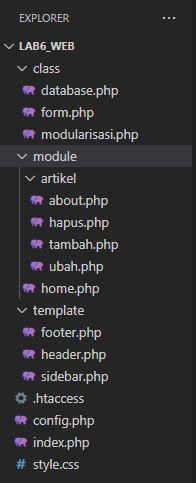
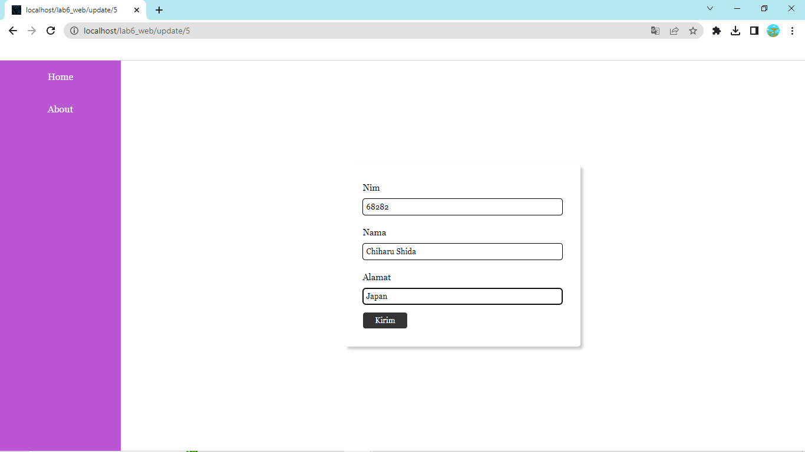
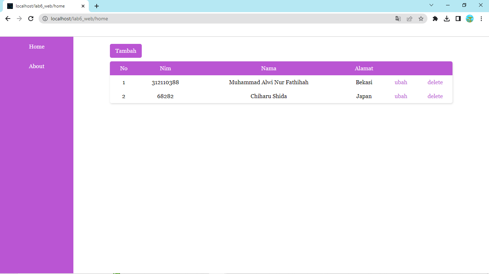

# Tugas Pemrograman Web 2 (Praktikum 6: OOP Lanjutan)
## Profil
| #               | Biodata                      |
| --------------- | ---------------------------- |
| **Nama**        | Muhammad Alwi Nur Fathihah   |
| **NIM**         | 312110388                    |
| **Kelas**       | TI.21.A.1                    |
| **Mata Kuliah** | Pemrograman Web 2            |

- Buat project baru dengan struktur sebagai berikut:

- Copy file library (class) dari praktikum 5 dan letakkan pada folder class.
- Buat file template yang berisi template dan css untuk header, footer dan menu sidebar.
- Buat modul artikel yang berisi CRUD dengan memanfaatkan library database dan form tersbut.
- File index.php berisi proses routing aplikasi dan dikombinasikan dengan penggunaan mod_rewrite pada file .htaccess

## Output
- Maka, hasilnya akan seperti gambar berikut.

1. Tambah

- Hasil Tambah

2. Ubah

- Hasil Tambah

# Terima Kasih!